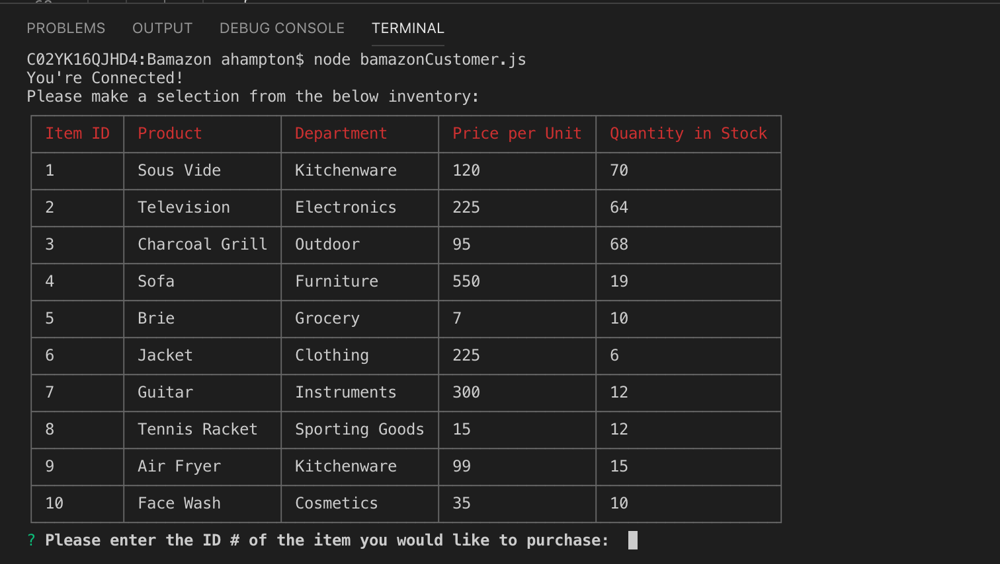
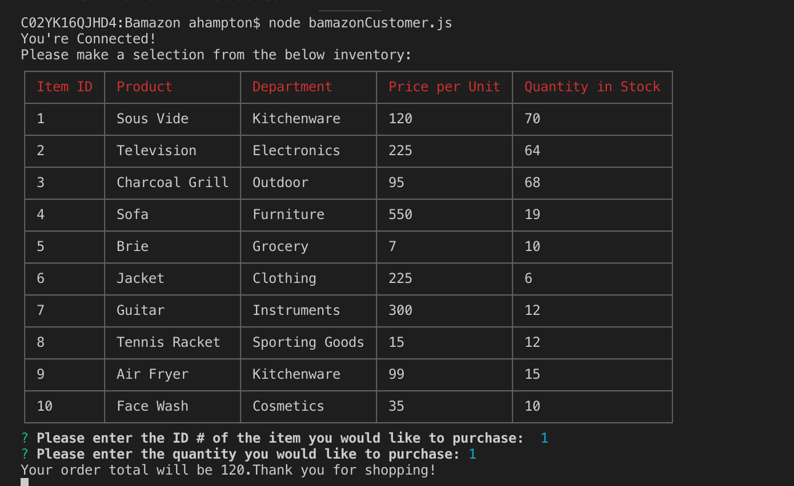
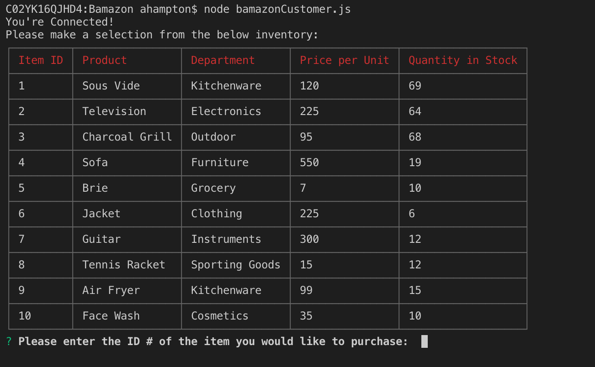

# Bamazon

# Assignment Overview: 

In this activity, I have created an Amazon-like storefront using Node JS and MySQL. The app takes in orders from customers and depletes stock from the store's inventory. 

# Screenshots: 
1) Table with available products is populated. User is prompted to select the unit id and quantity. 
 

2) The total price is displayed to the user, and thanks them for shopping. 

3) The quantity available is updated to reflect the sold inventory. 

